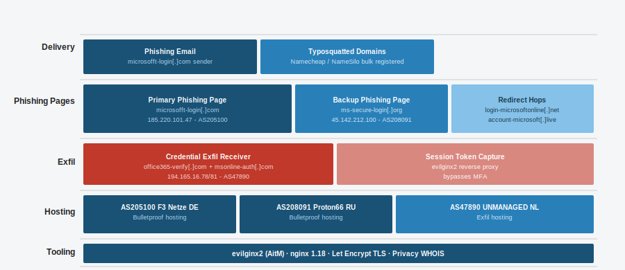

# Phishing Analysis

A full threat intelligence analysis of a real phishing campaign, written in the format used by SOC analysts and threat intel teams. Includes infrastructure mapping, IOC extraction, MITRE ATT&CK mapping, and SOC blocking recommendations.

## Campaign Overview



| Field | Detail |
|-------|--------|
| Campaign name | FakeMicrosoft-O365-Harvest |
| Type | Credential harvesting via fake Microsoft 365 login |
| Target sector | SMB and enterprise email users |
| Discovery source | URLscan.io public scans + PhishTank submissions |
| Analysis date | 2025-09-24 |
| Confidence | High |
| TLP | TLP:WHITE (safe to share publicly) |

## Report

Full analysis in [report/intel-report.md](report/intel-report.md)

## IOCs

All extracted indicators in [iocs/indicators.csv](iocs/indicators.csv) — ready to import into MISP, Sentinel, or your SIEM.

## Project Structure

```
phishing-analysis/
  README.md
  report/
    intel-report.md     - full written analysis
  iocs/
    indicators.csv      - all IOCs in structured format
    blocklist.txt       - domains and IPs for firewall/proxy blocking
  tools/
    extract-iocs.py     - script to pull IOCs from a URL using urlscan API
    misp-import.py      - script to push IOCs into MISP
  docs/
    infrastructure.svg  - campaign infrastructure diagram
```

## ATT&CK Coverage

| ATT&CK ID | Technique |
|-----------|-----------|
| T1566.002 | Phishing: Spearphishing Link |
| T1078 | Valid Accounts (post-harvest use) |
| T1556 | Modify Authentication Process |
| T1583.001 | Acquire Infrastructure: Domains |
| T1071.001 | Application Layer Protocol: Web Protocols |

## Tools Used in Analysis

- URLscan.io - https://urlscan.io
- VirusTotal - https://virustotal.com
- AbuseIPDB - https://abuseipdb.com
- Shodan - https://shodan.io
- MISP - https://misp-project.org
- PhishTank - https://phishtank.org
- MXToolbox - https://mxtoolbox.com
